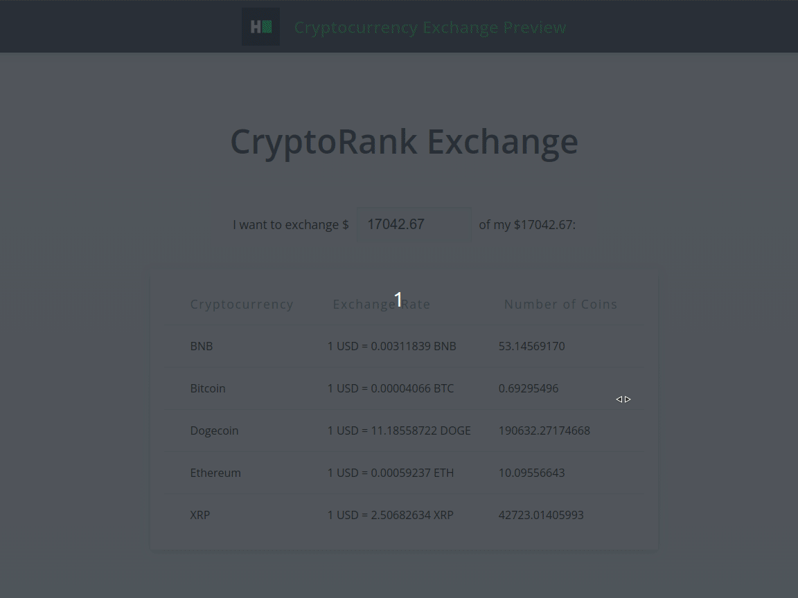

# Angular: Cryptocurrency Exchange Preview

* Score: 50
* Recommended Time: 30 minutes
* Tags:
    * Frontend
    * Easy
    * Angular
* Environment:
    * Node.js: v14.x (LTS, Fermium)
    * Angular: v14.2.10 (LTS)
* Repository: https://github.com/ProblemSetters/1475367-angular-cryptocurrency-exchange-preview
* Link: https://www.hackerrank.com/x/tests/all/1533044/questions/1475367/edit

---

The CryptoRank exchange, which is under development, requires a visual element that provides an estimate of the exchange
outcomes for converting fiat currency into cryptocurrency.
The user interface design phase is complete, but certain functional requirements are absent as outlined in the user
stories below.

**Functional Requirements**

The component must have the following functional parts.

1. Field: Amount to be exchanged
2. Table: Display the "Exchange Rate" and the "Number of Coins" for each cryptocurrency in a separate row.

**User Stories**

1. The user should be able to specify the amount to be exchanged within the available fiat balance.
    - The amount to be exchanged is mandatory and validated within the range of $0.01 to the entire available fiat
      balance.
    - If the field is left empty or out of range, an appropriate error message should be displayed.
    - By default, it should have the entire available fiat balance.
2. The user should be able to view updated conversions in the table when they modify the amount to be exchanged.
    - The "Number of Coins" column formula is `Amount to be exchanged * Exchange Rate`, rounded to 8 decimal places.
    - When an invalid amount to exchange is entered, the "Number of Coins" column should display `n/a`.

**Notes**

- When the amount to exchange field is empty, the error message `Cannot be empty` should appear.
- When the amount to exchange field is less than $0.01, the error message `Cannot be less than $0.01` should appear.
- When the amount to exchange field exceeds the available fiat balance, the error
  message `Cannot exceed the available balance` should appear.

**Input Data**

- Refer to the file: <src/shared/mock-api-response/profile-details.ts> for all required inputs about the available fiat
  balance.
- Refer to the file: <src/shared/mock-api-response/cryptocurrency-list.ts> for all required inputs about the
  cryptocurrency.
